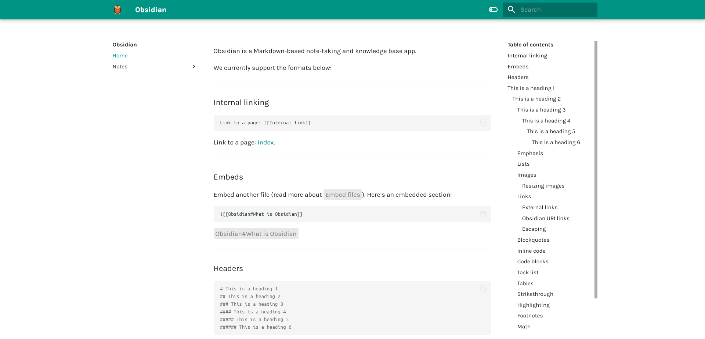
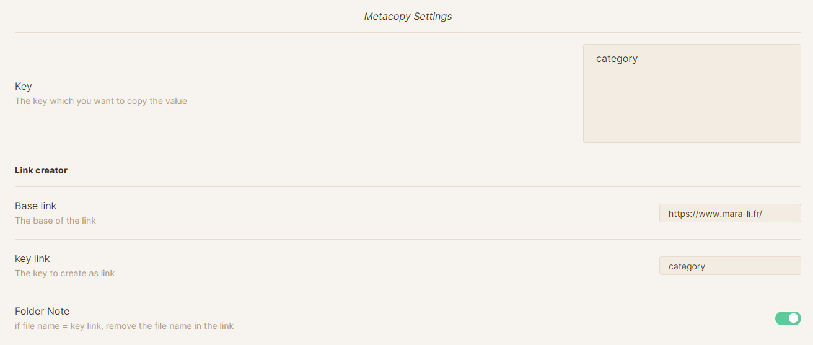
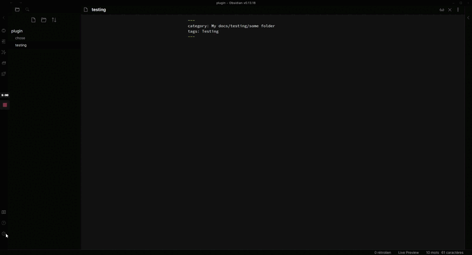

<p align="center">
	<a href="https://github.com/Mara-Li/mkdocs_obsidian_publish"></img></a>
	<a href="https://www.python.org/"></img></a>
	<a href="https://pypi.org/project/obs2mk/"></img></a>
	<a href="https://obsidian.md/"></img></a>
	<a href="https://github.com/Mara-Li/mkdocs_obsidian_template/wiki/Q&A/"></img></a>
</p>


# Mkdocs Obsidian
Mkdocs Obsidian is an association between a python script and a Material mkdocs template to get a personal wiki site based on your Obsidian Vault.


<p align="center"><a href="https://mara-li.github.io/mkdocs_obsidian_template/">Mkdocs Obsidian Template </a> </p>

<p align="center"><a href="https://www.mara-li.fr">Owlly Seed (My Blog ; In French)</a></p>

<details><summary><u><b>Screenshot</u></b> </summary>





</details>

## Pre-requiries

<details><summary><u><b>Requirements</u></b></summary>
	
- [Git](https://git-scm.com/)
- [Python](https://www.python.org/) and Pip
- [Mkdocs](https://www.mkdocs.org/getting-started/) : `pip install mkdocs`
- [Material Mkdocs](https://squidfunk.github.io/mkdocs-material/getting-started/) using `pip install mkdocs-material`
- [Mermaid2](https://github.com/fralau/mkdocs-mermaid2-plugin) with `pip install mkdocs-mermaid2-plugin`.
- [Roamlinks](https://github.com/Jackiexiao/mkdocs-roamlinks-plugin) : `pip install mkdocs-roamlinks-plugin`
- [mkdocs-obsidian](https://pypi.org/project/obs2mk/) : `pip install obs2mk`
- [mkdocs-awesome-pages](https://github.com/lukasgeiter/mkdocs-awesome-pages-plugin) : `pip install mkdocs-awesome-pages-plugin`
- [mkdocs-tooltipster](https://github.com/Mara-Li/mkdocs-tooltipster-links-plugin)
- [mkdocs-embed-file-plugins](https://github.com/Mara-Li/mkdocs_embed_file_plugins)

    </details>
	
You can install all package with `pip install -r requirements.txt`

## Get started
First, create the template in [GitHub](https://github.com/Mara-Li/mkdocs_obsidian_template) and download it with `git` (as `git clone git@github.com:your_username/blog_name.git`)

## Customization

To make it your, you need to change, in `mkdocs.yml`
- `site_name`,
- `site_description` 
- `site_url`
- The logo and favicons
- If you want, the palette, use [color scheme from material](https://squidfunk.github.io/mkdocs-material/setup/changing-the-colors/) and edit `scheme` and `accent`.

The material's theme includes a lot of parameters and personalization, so don't forget to check to make the site yours! Also, there is a hundred of plug-ins (“extension”) for mkdocs so don't hesitate to give an eye! [You will find a lot here](https://github.com/mkdocs/mkdocs/wiki/MkDocs-Plugins).

To try your site without online, use `mkdocs serve`.
You can publish your website using [Github Page](https://pages.github.com/) using the `gh-page` branch. This branch is pulled by the `.workflow` file, so don't worry about it.

Now you have two choices : move the file you want in `docs` (and the subfolder you want) or you can use `Mkdocs_Obsidian`.

## Obsidian compatibility
So, with the configuration I have done, the mkdocs support :
- Folder note : the file need to be named “index” (instead of the name of the folder)
- Admonition
- Wikilinks and relative links
- Highlight and tilde markdown
- Mathjax and Mermaid 
- Embed files (entire file, inline, heading)
- Custom Attribute, as [CM6 Attribute (with tags)](https://github.com/nothingislost/obsidian-cm6-attributes/releases), [Markdown Attribute](https://github.com/valentine195/obsidian-markdown-attributes) and [Contextual Typography (with tags)](https://github.com/mgmeyers/obsidian-contextual-typography).

I didn't found a way to embed file with wiki links for the moment. Because of the strange behavior of roam links, these embedded file will be rendered as image. The script will care of this bug. 


# Mkdocs Obsidian
## Utilities and interest
*A vast party of the script is taken from my previous project, YAFPA*

The script will care about some things you can forget :
- Moving your image in assets ;
- Change the admonition from the plugin to material admonition (mainly for codeblocks)
- Remove Obsidian comment (`%% text %%`) 
- **Create a folder structure** based on the `category` key. Without it, the note will be created in `docs/notes`.

If you use the `--meta` option, it will also add, in the **original file** a link to the blog. 

⚠️ If the script crash for any reason at the moment where the script updates the frontmatter, you can lose some file.

## Usage
```powershell
usage: obs2mk [-h] [--git | --mobile] [--meta] [--keep] [--config]
                   [--force] [--filepath FILEPATH | --ignore]

Create file in docs and relative folder, move image in assets, convert
admonition code_blocks, add links and push.

optional arguments:
  -h, --help            show this help message and exit
  --git, --g, --G       No commit and no push to git
  --mobile, --shortcuts, --s, --S
                        Use mobile shortcuts fonction without push.
  --meta, --m, --M      Update the frontmatter with link
  --keep, --k, --K      Keep deleted file from vault and removed shared file
  --config, --c, --C    Edit the config file
  --force, --d, --D     Force conversion - only work if path not specified
  --filepath FILEPATH, --f FILEPATH
                        Filepath of the file you want to convert
  --ignore, --ignore-share, --no-share, --i, --vault
                        Convert the entire vault without relying on share
                        state.
```

At the first start of the script, it will ask you :
- The **absolute path** of your vault and blog in your PC.
- The key you want to use to share the file (default : `share`).

This file will be in your `site_package/mkdocs_obsidian` folder.
> On pyto, it will be directly in site_package

You can reconfigure the option with `obs2mk --config`.

By default, the script will remove all file that doesn't exist in the vault, and file where you remove the share (`share: false`, or removed the key). You can keep all these file with `--k`. Empty folder will be also removed in this process.  

> A little note about "Folder Note": If the file has the same name as the last part of `category`, it will be renamed `index` during conversion.  
> However, this prevents the file from being deleted if its source is deleted from your vault: in this case, you have to delete it manually. 

> ⚠️ You need to configure and use an alias to cite an index file ; By default, this alias is `(i)` but it can be configured in environment configuration. 
> Some example : `[[Real file|(i) Alias]]` → `[[index|Alias]]` | `[[Real File|(i)]]` → `[[index|Real file]]`

> Git Note : If a folder is empty, it will be "erased" in git. 

### Share one file
To share **only** one file : `obs2mk --f FILEPATH`. It will :
- Update the state status in original file (`share: true`)
- Re-write the file if exist or create it in the folder you put in `category` 
This option will pull the file, regardless of what is the `share` state.

### Share “all” files
You can share multiple documents using the `share: true` key, in frontmatter. The script will scan your entire vault and automatically convert the file with this key.
There is two options :
- By default, the script will compare with the older version and write only if changement are detected, based on the content of the file and the last modified time. 
- Using `--force` will force the re-writing. 

You can force to skip the update with `update: false` in the frontmatter : the file, no matter what, will not be updated. 

#### Share the entire vault

Using the command `--ignore` will ignore the `share` state : you can share your entire vault using that, whatever the state is. By default, it will not overwrite file already exist (and not different), so the `--force` option can also be used.

`usage: obs2mk [-h] [--git | --mobile] [--meta] [--keep] [--config]
                   [--force] [--ignore]`

### Mobile

<details><summary><i>Read more</i></summary>
	
The mobile option is similar to the `git` option but with some nuance. When used to publish a single file, you can use only the file name, without the path.

:warning: Be careful though, in case you have several files with the same name, the script will take the first file found. 

This option can be used especially with the "Shortcuts" application on IOS, to share a file directly from the share sheet.

One file usage : `obs2mk --mobile --f "filename"`
All file usage : `obs2mk --mobile`

Mobile supports all previous option, including `--ignore`.

### IOS 
Using :
- [a-shell](https://holzschu.github.io/a-Shell_iOS/) (Free)
- [Working Copy](https://workingcopyapp.com/)
You can update the docs.

First, in a-shell, run `pickFolder` and choose the folder of your vault, and rerun `pickFolder` to choose the folder where are the blog data (you need to clone with [Working Copy](https://workingcopyapp.com/))
After, do `showmarks` and copy the two path in any note app. Check if the path is not broken because of the paste!
You can also do :
```bash
cd 
showmarks > bookmark
vim bookmark
```

Here is a blank sheet to help you if you want to manually write / edit it :
```
vault=
blog_path=
blog=
share=
index_key=
```
With :
- `vault`: Vault Absolute Path
- `blog_path` : Blog repository absolute path
- `blog` : Blog link (same as `site_url` from `mkdocs.yml`)
- `share` : your wanted share key ; by default : `share`
- `index_key`: For folder note citation

Before running the shortcuts, you need to install all requirements, aka :
```
pip install obs2mk
obs2mk --config
```

After, in a-shell, you can use the same option as on a PC.
</details>

## Customization
There are some files to customize the script :
- You can create [custom admonition with material docs](https://squidfunk.github.io/mkdocs-material/reference/admonitions/) and adding the name in `custom_admonition.yml`. 
- You can completely exclude some folder of your vault with `exclude_folder.yml`. You can exclude specific path as `folder1/subfolderA` etc.
- Using the `\docs\assets\css\custom_attributes.css` you can create specific aspect for your tags, and it also adds compatibility with CM6 Attribute and Contextual Typography. 

## Limitation
- **Nested admonition doesn't work for the moment.** I don't use it a lot, but if you want, you could improve the script or create a mkdocs plugin to care of that. 
- The script will not delete the file and folder if you change the `category` key. Beware of this. 
- Share “all” can be long on big vault. 
- File with same name can have some problem while scanning because I don't keep your folder structure. Please, beware of this! Don't forget, you can use `title` if you want a specific name (and this name already exist). 


## Support
The script can work on any platform that support python. The script doesn't use Cpython, so don't worry about it for IOS.

### Obsidian
→ Please use Wikilinks with “short links” (I BEG YOU)  

You can integrate the script within obsidian using the nice plugin [Obsidian ShellCommands](https://github.com/Taitava/obsidian-shellcommands).  
You could create two commands :
1. Publish everything: Alias `Publish` with `obs2mk --obsidian`
3. Publish one specific file : Alias `Publish {{title}}` with `obs2mk --obsidian --f {{file_path:absolute}}`

With the `0.10` you could also add event shortcuts :
- File menu event `Publish {{event_file_name}}`: `obs2mk --obsidian --f "{{event_file_path:absolute}}"`
- Folder Note event `Publish {{event_folder_name}}`: `obs2mk --obsidian --f "{{event_folder_path:relative}}\{{event_folder_name}}.md"`

You can use :
- [Customizable Sidebar](https://github.com/phibr0/obsidian-customizable-sidebar)  
- [Obsidian Customizable Menu](https://github.com/kzhovn/obsidian-customizable-menu)  
To have a button to share your file directly in Obsidian !

#### Metacopy
Using [metacopy](https://github.com/Mara-Li/obsidian-metacopy) you can quickly copy a link to a shared page, without using this option (so, yes, the script does not edit your source file !). 
To create a link, you need to configure :
 1. `category` in `key`
 2. Add your `set_url` in `base link`
 3. Add `category` in `key link`

Also, you can remove the metacopy from your file menu using a key, so you can active metacopy only for `share: true`. Metacopy support also the `paginations.index`. 

The final configuration of metacopy for mkdocs_obsidian will be :



So, in the end, a menu will appear on file with `share: true` and a `category` configured. This menu is on the left click and the file-menu. You can quickly copy a link from there, like a google or notion sharing link !

[Here is a demo](https://www.loom.com/share/88c64da2ba194e219578d5911fb8e08d) : 

[](https://www.loom.com/share/88c64da2ba194e219578d5911fb8e08d)

# Frontmatter and option
## Script
The script need one key, to share the file. You can configure the key in the configuration of the script.
If you want a folder structure in `docs`, you need to use the `category` keys, with the form of `path/path`. You can also block a file to update with `update: false`.
Note : With `awesome-pages` you can hide folder from navigation. To hide a file, just use `hidden` in `category` (as `category: hidden`). Links, image will work without problem.

## Mkdocs
Material give you the possibility to add SEO tags with :
- `description`  
- `title` (will change also the title in the navigation)
- `image`: Add an image (don't forget the format) / Need to be a relative link.

## Template
So, the final frontmatter template is :
```yaml
---
title:
share:
description:
category:
---
```

If you have more question, don't forget to read the [Q&A](https://github.com/Mara-Li/mkdocs_obsidian_template/wiki/Q&A/) !
